  

<table border="0" align="center">
<tr border="0">
<td width="50%" align="center">
  
  ## 📊 GitHub Stats
  
  
    
   
</td>

<td width="50%" align="center">

  ## 🛠️ Languages and Tools
  
  
  
</td>
</tr>
</table>

 

  <h2> Tech Stack</h2>
  
  

    
  

 

## 📫 Connect with me

  
  <!-- Weitere Social Media Links hier -->

 

   

  

